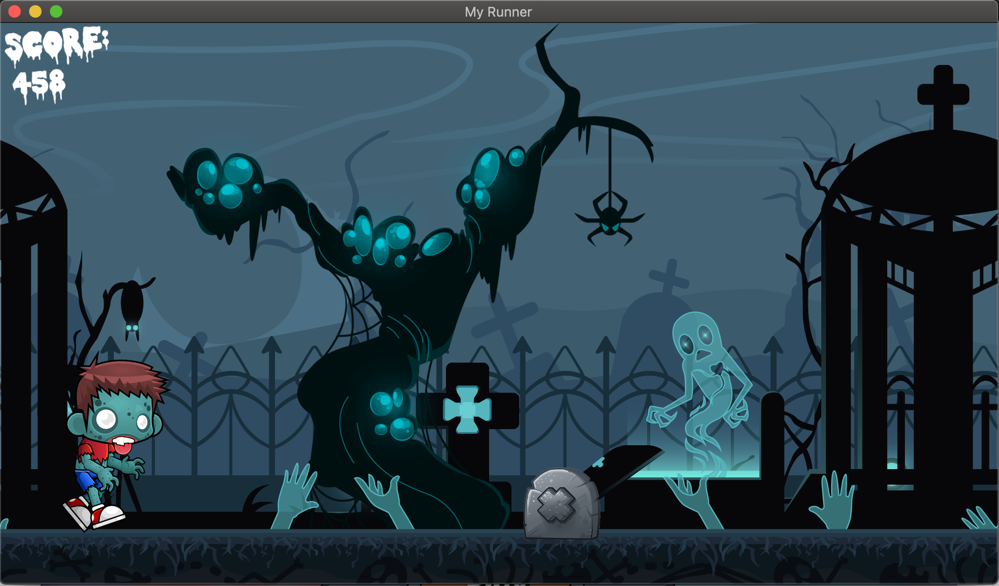

# MUL_my_runner_2018
Réalisation d'un jeu en C (lib SFML) type Runner/GeometryDash, réalisation des graphismes.

## BIENVENUE SUR LE RUNNER

DESCRIPTION : 
- Lancez le jeu et suivez les instructions.
- Sautez avec la touche 'SPACE'
- Ouvrez le menu avec la touche 'ESC'.
- Quittez le jeu avec la touche 'Q'.
- Il se peut que vous soyez obligé de traverser légèrement l'obstacle pour le passer.

UTILISATION : 
./my_runner

## WELCOME ON THE RUNNER

DESCRIPTION : 
- Start the game and follow the instructions.
- Jummp thanks to 'SPACE'
- Open the menu with 'ESC'.
- Quit thanks to 'Q'.
- You will have some difficult for pass obstacles, you have to cross a little the obstacle for pass it

OPTION : 
./my_runner

**************

### Quick Preview
